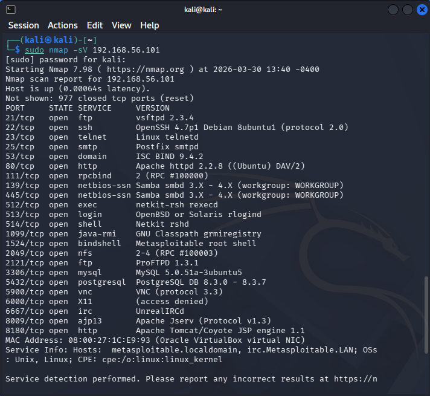
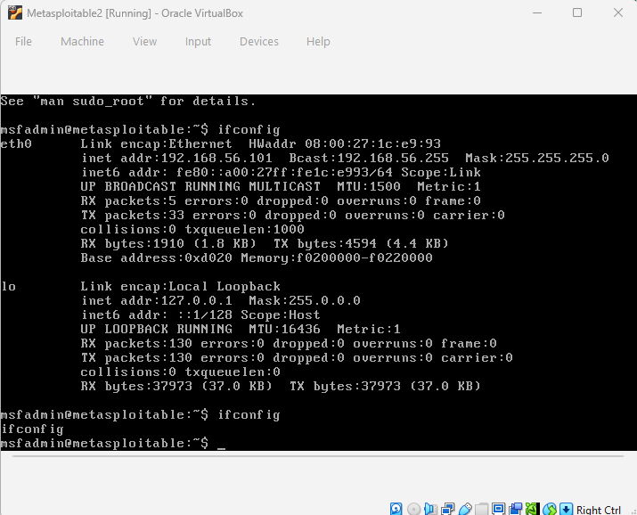
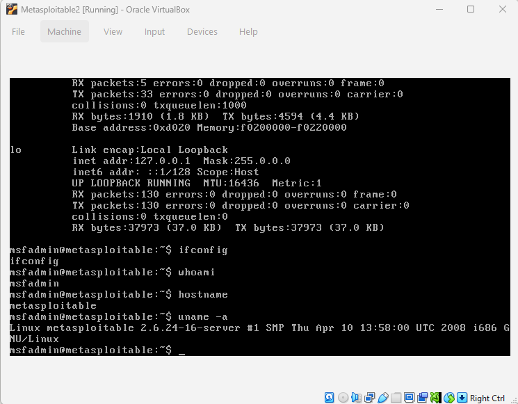

# Investigation 004 - Metasploitable Root Shell Exploitation

## Date
2026-03-30

## Objective
Perform a full attack chain against Metasploitable2 - 
from reconnaissance to root access.

## Lab Setup
- **Attacker:** Kali Linux (192.168.56.102)
- **Target:** Metasploitable2 (192.168.56.101)
- **Network:** VirtualBox Host-only (isolated)

## Phase 1 - Reconnaissance
### Nmap Scan Command
```
sudo nmap -sV 192.168.56.101
```
### Open Ports Discovered
22 open ports including critical services:
- 21/tcp - vsftpd 2.3.4 (known backdoor)
- 23/tcp - Telnet (plaintext passwords)
- 1524/tcp - Metasploitable root shell
- 3306/tcp - MySQL database
- 5900/tcp - VNC remote desktop
- 6667/tcp - UnrealIRCd (known backdoor)

## Phase 2 - Exploitation
### Command Used
```
nc 192.168.56.101 1524
```
### Result
Immediate root shell obtained with no credentials required!
```
root@metasploitable:/# 
```

## Risk Analysis
Port 1524 is a bindshell backdoor that provides instant 
root access to anyone who connects to it. This represents 
a critical severity vulnerability.

## What an Attacker Could Do
- Read all system files
- Create new backdoor users
- Install malware
- Pivot to attack other machines
- Steal all data

## Screenshot





## Detection & Prevention
- **Detect:** Monitor unusual port connections in Splunk
- **Prevent:** Close unnecessary ports via firewall rules
- **Harden:** Disable unused services

## Conclusion
This demonstrates why regular port scanning of your own 
infrastructure is critical. An open bindshell on port 1524 
gives instant root access - this would be catastrophic in 
a real environment.
