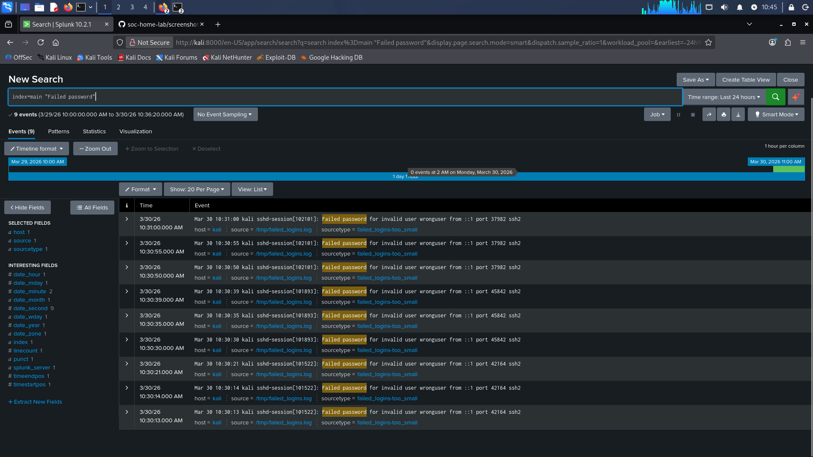

# Investigation 001 - Failed SSH Login Detection

## Date
2026-03-30

## Objective
Detect brute force SSH login attempts using Splunk SIEM

## Tools Used
- Kali Linux
- Splunk Enterprise 10.2.1
- SSH service

## What Happened
Simulated a brute force attack by repeatedly attempting SSH login 
with an invalid user "wronguser" from localhost.

## Splunk Search Used
index=main "Failed password"

## Findings
- 9 failed login events detected
- Invalid user: wronguser
- Source IP: ::1 (localhost)
- Attempts made across 3 separate sessions
- Time range: 10:30 - 10:31 AM

## Screenshot

## Conclusion
Multiple failed SSH login attempts from the same source IP 
in a short time window is indicative of a brute force attack.
This would trigger an alert in a real SOC environment.
